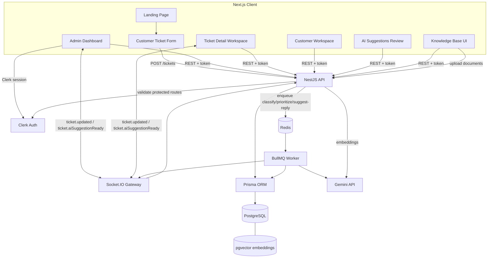

# PulseDesk Architecture

PulseDesk is a full-stack support operations SaaS built as a production-shaped MVP. It combines a Next.js dashboard, NestJS API, PostgreSQL relational storage, pgvector retrieval, Redis-backed background jobs, Gemini AI generation, Clerk authentication, and Socket.IO realtime updates.

The current implementation supports public ticket intake, an authenticated admin dashboard, ticket workspaces with conversation threads and internal notes, customer profiles with activity timelines, AI suggestion review, editable human approval, SLA indicators, and a lightweight RAG retrieval evaluation workflow.

## High-Level Overview

- `client/`: Next.js App Router frontend for the public landing page, customer ticket form, authenticated dashboard, ticket workspace, customer workspace, AI suggestions review, and knowledge-base management.
- `server/`: NestJS backend for REST APIs, Clerk-protected admin endpoints, Prisma data access, BullMQ workers, Gemini integration, RAG ingestion and retrieval, SLA calculation, and Socket.IO realtime events.
- `packages/shared/`: shared TypeScript contracts used across the client and server.
- PostgreSQL stores users, customers, tickets, ticket messages, AI suggestions, and knowledge-base chunks.
- pgvector stores knowledge-base embeddings in PostgreSQL so semantic retrieval can run near the relational data.
- Redis backs BullMQ queues for asynchronous AI classification, prioritization, and reply suggestion generation.
- Gemini provides embeddings and structured AI generation.
- Socket.IO pushes small ticket update events to the dashboard, while TanStack Query polling remains as a fallback.

## Architecture Diagram



## Frontend Architecture

The frontend uses the Next.js App Router and Clerk's Next.js integration. Server state is managed with TanStack Query, and realtime events invalidate relevant query caches instead of mutating large client-side objects manually.

Public routes:

- `/`: portfolio-ready landing page.
- `/submit-ticket`: public customer ticket submission form.
- `/sign-in/[[...sign-in]]`: Clerk sign-in.
- `/sign-up/[[...sign-up]]`: Clerk sign-up.

Protected dashboard routes:

- `/dashboard`: admin overview with ticket KPIs, SLA indicators, and recent ticket activity.
- `/dashboard/tickets`: ticket queue with filters, desktop table layout, and mobile card layout.
- `/dashboard/tickets/[id]`: support workspace with ticket detail, SLA status, conversation thread, internal notes, AI safety indicators, and editable AI reply approval.
- `/dashboard/ai-suggestions`: review list for AI suggestions, linked back to related ticket workspaces.
- `/dashboard/customers`: customer list with search and ticket counts.
- `/dashboard/customers/[id]`: customer profile with metrics, recent tickets, and derived activity timeline.
- `/knowledge-base`: protected document upload and knowledge-base management.

Route paths are centralized in `client/lib/routes.ts` through helpers such as `routes.dashboard()`, `routes.ticketDetail(id)`, `routes.aiSuggestions()`, and `routes.customerDetail(id)`. This keeps dashboard navigation, table links, cards, and CTAs aligned with the App Router file structure.

The UI uses a Tailwind-based B2B SaaS design system. Graphite and zinc surfaces provide the base palette, emerald and teal indicate healthy/generated states, amber indicates review or internal-note states, and rose indicates failed or high-risk states. Responsive layouts avoid horizontal overflow by switching dense tables to cards on smaller screens.

## Backend Architecture

The NestJS backend is organized by feature modules:

- `auth`: Clerk token validation, current user extraction, and protected endpoint guard.
- `tickets`: public ticket creation, protected ticket listing/detail, status updates, AI suggestion generation endpoint, AI suggestion approval, ticket messages, and internal notes.
- `customers`: protected customer list, customer detail, recent ticket metrics, and derived activity timeline.
- `knowledge-base`: document upload, parsing, chunking, embedding, listing, and semantic search.
- `ai`: Gemini wrapper for embeddings and structured JSON generation.
- `ai-suggestions`: protected list API for reviewing generated suggestions across tickets.
- `queue`: BullMQ queue registration, ticket AI enqueueing, and worker processing.
- `realtime`: Socket.IO gateway/service and CORS configuration using `CLIENT_URL`.
- `prisma`: Prisma client lifecycle and database access.

Public ticket creation is intentionally unauthenticated so customers can submit support requests. Admin dashboard APIs are protected with `ClerkAuthGuard`.

## Data Model Overview

- `User`: dashboard/admin user mapped to a Clerk user id. Users can be assigned to tickets.
- `Customer`: customer identity record with name, email, optional company name, and related tickets.
- `Ticket`: core support request with status, priority, category, customer relation, optional assigned admin, AI suggestions, messages, timestamps, and resolution timestamp.
- `TicketMessage`: chronological conversation item for a ticket. Messages can be authored by `CUSTOMER`, `ADMIN`, `AI`, or `SYSTEM`, and can be marked as internal notes.
- `KnowledgeDocument`: stored knowledge-base chunk with source metadata, normalized content, optional pgvector embedding, and active state.
- `TicketAiSuggestion`: AI-generated support suggestion with status, suggested reply, original draft, final approved reply, approval metadata, suggested category/priority, confidence score, retrieval context, and optional error message.

The schema keeps AI output as reviewable data. Approved replies are stored separately from the original AI draft so the product can show whether a human approved the draft as-is or edited it first.

## Ticket Workflow

1. A customer submits a ticket from `/submit-ticket`.
2. The NestJS tickets module validates the payload, upserts the customer by email, and stores the ticket.
3. The queue module enqueues AI jobs in BullMQ.
4. The worker classifies the ticket category and emits `ticket.updated`.
5. The worker predicts priority and emits another `ticket.updated`.
6. The worker retrieves relevant knowledge-base chunks and generates a draft support reply.
7. The suggestion is stored as `TicketAiSuggestion`, and `ticket.aiSuggestionReady` is emitted.
8. An admin reviews the suggestion in `/dashboard/tickets/[id]`.
9. The admin can reset the editor to the AI draft, approve the draft as-is, or save an edited approval.
10. Approval updates the suggestion and adds the approved reply to the ticket conversation as an admin message.
11. The MVP does not send external customer email automatically.
12. The ticket can later be updated or resolved by the admin workflow.

If AI suggestion generation fails, the backend records a failed suggestion state and emits a small `ticket.updated` payload so the UI can show the failure without crashing the ticket flow.

## RAG Workflow

1. An admin uploads a supported knowledge-base file from `/knowledge-base`.
2. The backend parses the document and normalizes text.
3. The chunker splits content into overlapping chunks.
4. Gemini generates an embedding for each chunk.
5. Chunks and embeddings are stored in `KnowledgeDocument` rows using pgvector.
6. During reply suggestion generation, the ticket context is embedded.
7. `KnowledgeBaseService.searchRelevantChunks(question)` retrieves the most relevant chunks from PostgreSQL/pgvector.
8. Retrieved snippets are passed into Gemini as grounding context.
9. The generated suggestion stores confidence and retrieval context so the UI can show snippets, limitations, and manual verification warnings.

This is MVP-level RAG. It improves grounding, but it does not guarantee factual correctness or defend fully against malicious knowledge-base content.

## Queue Workflow

BullMQ keeps expensive model calls off the request path. Ticket creation remains fast because AI work is handled asynchronously.

Current ticket AI jobs:

- `classify`: predicts a support category.
- `prioritize`: predicts ticket priority.
- `suggest-reply`: retrieves RAG context and generates a draft response.

Each job updates only the relevant ticket or suggestion fields. Realtime events are emitted after useful state changes so the dashboard can refresh without requiring a manual reload.

## Realtime Workflow

PulseDesk uses Socket.IO through the NestJS realtime module.

Events:

- `ticket.updated`: emitted after classification, priority prediction, ticket status updates, and failed AI states.
- `ticket.aiSuggestionReady`: emitted after a suggestion is generated successfully.

The frontend connects to `NEXT_PUBLIC_API_URL`, listens for these events, and invalidates TanStack Query caches for ticket lists, dashboard summaries, AI suggestion lists, and the active ticket detail when relevant. If the socket connection fails, polling remains in place as a fallback.

## Customer Workspace Workflow

The customers module supports:

- paginated and searchable customer listing;
- customer detail with basic profile data;
- ticket metrics such as total, open, and resolved tickets;
- recent ticket history;
- derived activity timeline.

The timeline is calculated from existing records instead of a separate event table. It normalizes customer creation, ticket creation/update, AI suggestion generation, approved AI replies, messages, internal notes, and resolved tickets into a single newest-first response. This is appropriate for the MVP and keeps persistence simple, but a production audit log would likely use a dedicated append-only event table.

## SLA Workflow

SLA status is calculated dynamically from ticket priority and `createdAt`. The values are not persisted yet.

First response targets:

- `URGENT`: 1 hour.
- `HIGH`: 4 hours.
- `MEDIUM`: 24 hours.
- `LOW`: 48 hours.
- Missing priority defaults to `MEDIUM`.

The calculated SLA result includes:

- `dueAt`;
- `minutesRemaining`;
- `status`: `ON_TRACK`, `DUE_SOON`, or `OVERDUE`.

`DUE_SOON` means the due time is within the next 30 minutes for urgent/high tickets, or within the next 4 hours for medium/low tickets. The frontend shows these states with text labels and consistent emerald/teal, amber, and rose styling.

## RAG Evaluation

PulseDesk includes a lightweight retrieval evaluation dataset at `server/evals/rag-eval-cases.json` and a script at `server/scripts/evaluate-rag.ts`.

Run it with:

```bash
pnpm eval:rag
```

The script loads representative support questions, calls `KnowledgeBaseService.searchRelevantChunks(question)`, and checks whether the expected knowledge-base document appears in the retrieved results.

Metrics:

- Top-1 accuracy: the expected document was the first retrieved result.
- Top-3 accuracy: the expected document appeared anywhere in the first three retrieved results.

Retrieval testing matters because a RAG system can only produce grounded answers if the right source material is retrieved before generation. This evaluation is intentionally narrow: it measures retrieval quality, not final answer faithfulness, hallucination rate, prompt-injection resistance, or user satisfaction. Future production work should add answer-quality review, hallucination scoring, prompt-injection test cases, and a human-labeled evaluation set.

## Why pgvector For The MVP

pgvector was chosen because it keeps relational data and vector retrieval in the same PostgreSQL deployment. That reduces operational complexity for a portfolio-ready SaaS MVP and works well with Docker, Prisma migrations, and small support knowledge bases.

The trade-off is that large-scale vector workloads may eventually need a dedicated retrieval service, stronger indexing strategy, tenant-aware retrieval controls, and more detailed observability. For PulseDesk's current scope, pgvector provides the right balance of capability and simplicity.
