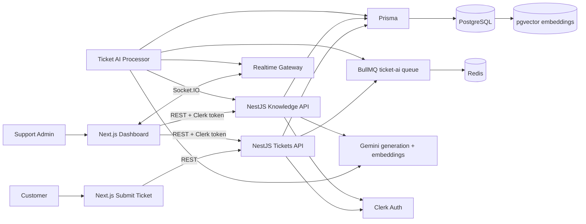

# Architecture

## Overview

PulseDesk is a pnpm monorepo with three main parts:

- `client/`: Next.js App Router frontend for the landing page, public ticket submission, authenticated dashboard, ticket detail, and knowledge-base workspace.
- `server/`: NestJS API for tickets, knowledge-base ingestion, AI jobs, Clerk authentication, Socket.IO realtime events, Prisma, and BullMQ workers.
- `packages/shared/`: shared TypeScript DTOs used by the client and server.

The system is intentionally shaped like a production SaaS MVP: requests stay fast, expensive AI work runs in the background, data is persisted in PostgreSQL, vector retrieval is handled by pgvector, and the frontend updates through realtime events with polling fallback.

## System Diagram

## Frontend

The frontend is a Next.js App Router app. Public pages include the landing page and ticket submission flow. Protected pages include the admin dashboard, ticket detail workspace, and knowledge-base workspace.

Key frontend responsibilities:

- Render a responsive B2B SaaS interface across mobile, tablet, and desktop.
- Submit public customer tickets to the NestJS API.
- Authenticate protected dashboard routes with Clerk.
- Fetch server state with TanStack Query.
- Invalidate ticket lists and ticket details when Socket.IO events arrive.
- Keep polling fallback active when realtime connection is unavailable.
- Surface AI safety indicators: confidence, retrieved snippets, limitations, and manual verification state.

The dashboard table converts to mobile cards to avoid horizontal overflow and preserve ticket scanning on small screens.

## Backend

The backend is a NestJS API organized around feature modules:

- `tickets`: ticket creation, listing, detail view, status updates, and synchronous AI suggestion endpoint.
- `knowledge-base`: document upload, text extraction, chunking, embedding storage, document listing, and semantic search.
- `queue`: BullMQ configuration, ticket AI enqueueing, and the ticket AI processor.
- `ai`: Gemini embedding and JSON generation provider.
- `auth`: Clerk token validation guard for protected endpoints.
- `realtime`: Socket.IO gateway and service for ticket events.
- `prisma`: database connection and Prisma service.

Public ticket creation remains available without dashboard authentication. Admin ticket views, ticket updates, and knowledge-base operations require Clerk authentication.

## Database

PostgreSQL is the source of truth for:

- customers;
- admin users;
- tickets;
- knowledge-base chunks;
- AI suggestions;
- AI status and retrieved context.

Prisma provides typed access and migrations. The schema enables normal relational queries for tickets and customers while also storing embeddings on knowledge-base rows.

## pgvector

PulseDesk uses PostgreSQL pgvector to store and search knowledge-base embeddings.

Why pgvector was chosen for the MVP:

- It keeps relational data and vector data in one database, reducing operational overhead.
- It works well with Prisma migrations plus raw SQL for vector-specific operations.
- It is easy to run locally through the `pgvector/pgvector:pg16` Docker image.
- It is sufficient for the MVP scale: small support knowledge bases, demo datasets, and low-volume semantic retrieval.
- It avoids introducing a separate vector database before the product needs one.

For larger production workloads, a dedicated vector store or search service could be evaluated once retrieval volume, indexing needs, and tenant isolation requirements are clearer.

## Redis And BullMQ

Redis backs BullMQ for asynchronous ticket AI processing. When a ticket is created, the server enqueues three jobs:

- `classify`: predicts the ticket category.
- `prioritize`: predicts support priority.
- `suggest-reply`: retrieves knowledge snippets and generates a draft response.

This keeps ticket creation responsive even when model calls are slow or unavailable. BullMQ also gives the MVP retries, backoff, and job isolation without building custom worker infrastructure.

## Gemini

Gemini is used for two AI capabilities:

- Embeddings: convert knowledge chunks and ticket queries into vectors.
- JSON generation: classify tickets, predict priority, and draft support replies.

The AI service wraps provider calls so the rest of the backend depends on simple methods: `embedText` and `generateJson`. Prompts require strict JSON output and include human-review instructions. Generated replies are stored as suggestions, not sent messages.

## Clerk

Clerk handles authentication for dashboard users. The frontend uses Clerk's Next.js integration for sign-in and sign-up pages. The backend validates Clerk session tokens through a NestJS guard before allowing protected admin and knowledge-base operations.

Relevant backend settings:

- `CLERK_SECRET_KEY`
- `CLERK_PUBLISHABLE_KEY`
- `CLERK_JWT_KEY`
- `CLERK_AUTHORIZED_PARTY`

`CLERK_AUTHORIZED_PARTY` should match the frontend origin in production.

## Realtime Flow

PulseDesk uses Socket.IO for live dashboard updates.

Events:

- `ticket.updated`: emitted after classification, priority prediction, status updates, or failed AI work.
- `ticket.aiSuggestionReady`: emitted after reply suggestion generation.

The frontend listens for these events and invalidates the relevant TanStack Query caches:

- ticket list cache;
- dashboard summary cache;
- ticket detail cache when the current ticket is affected.

If the Socket.IO connection fails, the dashboard keeps polling as a fallback.

## Request Flow

1. A customer submits a ticket from the public Next.js form.
2. NestJS validates the DTO, creates or updates the customer, and stores the ticket.
3. The queue service enqueues AI jobs in BullMQ.
4. The AI processor classifies, prioritizes, retrieves knowledge, and drafts a reply.
5. Prisma persists ticket updates and AI suggestions.
6. The realtime service emits small safe payloads.
7. The dashboard invalidates queries and refreshes the visible state.

## Knowledge-Base Flow

1. An admin uploads a PDF, TXT, or Markdown document.
2. NestJS extracts text and normalizes whitespace.
3. The chunker splits content into overlapping chunks.
4. Gemini generates embeddings for each chunk.
5. PostgreSQL stores the chunk text and vector.
6. During suggestion generation, the ticket text is embedded and compared against stored vectors.
7. The top matching snippets are included as grounding context and shown in the UI.

## Security And Safety Boundaries

The MVP is intentionally conservative:

- AI replies require human review.
- AI-generated replies are not automatically sent to customers.
- Knowledge-base documents and customer ticket text are treated as untrusted input.
- Protected dashboard endpoints require Clerk authentication.
- Demo mode should use fake or non-sensitive data.

Production hardening should add tenant isolation, stronger authorization rules, audit logging, PII redaction, prompt-injection scanning, and monitoring for AI failure and retrieval quality.
