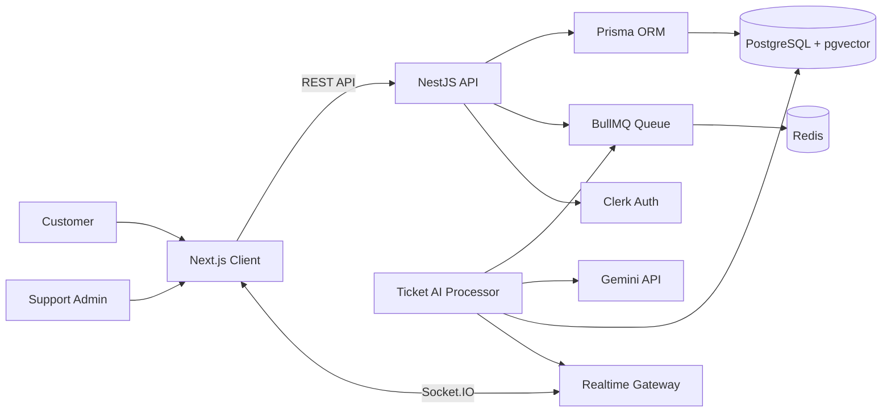

# PulseDesk Case Study

## Context

PulseDesk is a full-stack AI support desk MVP built as a portfolio project. The goal was to demonstrate how an AI-assisted SaaS product can be designed beyond a prompt demo: public customer intake, authenticated support operations, structured backend services, background AI jobs, RAG-backed suggestions, realtime updates, deployment docs, and explicit AI safety boundaries.

The product is intentionally scoped as an MVP, but the architecture mirrors production concerns: data modeling, asynchronous processing, authentication, vector search, Docker, CI, and careful handling of AI-generated output.

## Problem

Support teams often work across fragmented tools: ticket queues, customer history, internal documentation, AI chat windows, and manual follow-up notes. This slows down triage and increases the risk of inconsistent replies.

AI can help summarize, classify, prioritize, and draft replies, but unreviewed AI output introduces risk. It can hallucinate product policy, miss customer-specific context, or provide a confident answer when the knowledge base is incomplete.

PulseDesk addresses this by positioning AI as an internal assistant for support operators, not an autonomous customer responder.

## Technical Solution

PulseDesk combines a Next.js dashboard, NestJS API, PostgreSQL pgvector database, Redis/BullMQ job queue, Gemini AI integration, Clerk authentication, and Socket.IO realtime updates.

The workflow is:

1. A customer submits a support ticket through the public Next.js form.
2. NestJS validates the payload, persists the ticket, and enqueues AI jobs.
3. BullMQ workers classify the ticket, predict priority, retrieve relevant knowledge-base snippets, and generate a suggested reply.
4. PostgreSQL stores tickets, customers, knowledge chunks, embeddings, and AI suggestions.
5. Socket.IO emits ticket update events so the dashboard refreshes quickly.
6. The admin reviews confidence, retrieved snippets, limitations, and the AI draft before approving or editing the reply.
7. Approved replies are added to the ticket conversation thread. The MVP does not send external customer email automatically.

The product keeps ticket creation fast by moving expensive AI calls out of the request path.

## Architecture

The system is organized as a pnpm monorepo:

- `client/`: Next.js App Router frontend.
- `server/`: NestJS backend, Prisma, BullMQ worker, Socket.IO gateway.
- `packages/shared/`: shared TypeScript DTOs.

## Key Implementation Details

- Built a responsive support dashboard with KPI cards, filtering, ticket list, mobile cards, loading states, empty states, error states, and realtime status indicators.
- Implemented public ticket creation with DTO validation, customer upsert logic, queue enqueueing, and AI status tracking.
- Added a ticket detail workspace with ticket metadata, customer context, SLA indicators, conversation thread, internal notes, AI suggestion display, confidence score, retrieved snippets, limitations, and editable AI approval.
- Added customer management with searchable customer profiles, recent ticket history, ticket metrics, and a derived activity timeline.
- Created a knowledge-base workflow for PDF, TXT, and Markdown upload, text parsing, normalization, chunking, embedding generation, and document listing.
- Added Socket.IO events for `ticket.updated` and `ticket.aiSuggestionReady`, with TanStack Query invalidation on the frontend.
- Added backend tests for chunking behavior, strict AI JSON parsing, DTO validation, knowledge-base similarity search with mocks, and BullMQ enqueueing.
- Added a lightweight RAG retrieval evaluation script that reports top-1 and top-3 retrieval accuracy for seeded support questions.
- Documented local development, deployment, AI safety, architecture, and demo flow.

## AI/RAG Design

PulseDesk uses Gemini for both embeddings and structured JSON generation.

Knowledge-base documents are processed into overlapping chunks. Each chunk is embedded and stored in PostgreSQL using pgvector. During reply suggestion generation, the ticket subject and description are embedded, compared against stored vectors, and the most relevant snippets are passed into the prompt as grounding context.

The AI prompt asks for strict JSON with:

- summary;
- reply draft;
- context sufficiency;
- citations;
- confidence score;
- human-review requirement;
- internal notes.

The frontend exposes this context instead of hiding it. If no knowledge-base context is found, the UI shows a visible manual-verification state. AI output is always treated as a draft requiring human review. When an admin approves a reply, PulseDesk stores the final approved text and tracks whether it was edited before approval.

## DevOps Setup

PulseDesk includes a deployment-oriented setup:

- Docker Compose runs PostgreSQL pgvector and Redis locally.
- The NestJS server has a production Dockerfile using Node 20 Alpine, pnpm through Corepack, multi-stage build, Prisma generation, and a production runner stage.
- GitHub Actions CI separates client and server jobs.
- The server CI job includes PostgreSQL pgvector, Redis, Prisma generation, linting, tests, and build.
- Deployment docs cover Vercel for the frontend and Railway for the backend, including CORS, Clerk, Gemini, Redis, and pgvector notes.

This setup is intentionally practical for an MVP: enough production discipline to show reliability without overbuilding infrastructure.

## Challenges And Trade-Offs

**AI safety vs. automation**

The product deliberately avoids automatic AI replies. This limits automation, but it makes the MVP safer and more credible for real support workflows.

**pgvector vs. dedicated vector database**

pgvector was chosen because it keeps relational data and vector search in one PostgreSQL system. This reduces operational complexity for MVP scale. A dedicated vector database could become useful later for larger corpora, stronger filtering, or more advanced retrieval patterns.

**Realtime plus polling fallback**

Socket.IO improves dashboard responsiveness, but realtime connections can fail in deployed environments. The frontend keeps polling fallback in place so the product remains usable.

**Monorepo deployment**

The server depends on shared workspace types, so Docker and deployment configuration must use the repository root as build context. This is slightly more complex than a single-service repository, but it keeps shared DTOs consistent across client and server.

**RAG grounding limitations**

Retrieval helps reduce hallucination, but it does not guarantee correctness. The UI surfaces snippets, confidence, and limitations so the reviewer can make the final judgment.

## What I Would Improve Next

- Add customer email sending after human approval, with approval audit logs.
- Add tenant/workspace data isolation and role-based permissions.
- Add prompt-injection and secret scanning for uploaded knowledge-base documents.
- Add PII redaction before model calls.
- Add document versioning, source ownership, and review status for knowledge-base content.
- Add observability for queue latency, AI failure rates, retrieval quality, and reviewer edits.
- Expand evaluation beyond retrieval into classification, priority prediction, answer faithfulness, hallucination checks, and suggested replies.
- Add production-grade rate limiting and abuse protection for public ticket submission.

## CV Bullets

- Built PulseDesk, a full-stack AI support SaaS MVP with Next.js, NestJS, TypeScript, Clerk auth, responsive dashboard UX, Dockerized services, and GitHub Actions CI/CD.
- Implemented RAG-powered AI ticket assistance using Gemini, PostgreSQL pgvector embeddings, knowledge-base chunking, semantic retrieval, confidence display, retrieved snippets, and human-review safety states.
- Designed asynchronous ticket AI processing with Redis and BullMQ, including classification, priority prediction, reply suggestion jobs, Socket.IO realtime updates, and backend tests for queueing, DTO validation, AI parsing, and retrieval logic.
